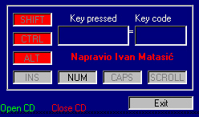

## Key press 1\.1

### Description

Detect what key you pressed, shows its keycode

detects if Numlock,Scroll Lock, Caps Lock and Insert are active or inactive. I did that using API. I also putted buttons so you can open or close your CD
 
### More Info
 

             |
---                |---
**Submitted On**   |2001-10-14 22:55:34
**By**             |[Ivan Matasiæ](https://github.com/Planet-Source-Code/PSCIndex/blob/master/ByAuthor/ivan-matasi.md)
**Level**          |Beginner
**User Rating**    |4.8 (19 globes from 4 users)
**Compatibility**  |VB 6\.0
**Category**       |[Miscellaneous](https://github.com/Planet-Source-Code/PSCIndex/blob/master/ByCategory/miscellaneous__1-1.md)
**World**          |[Visual Basic](https://github.com/Planet-Source-Code/PSCIndex/blob/master/ByWorld/visual-basic.md)
**Archive File**   |[Key press 2902310142001\.zip](https://github.com/Planet-Source-Code/ivan-matasi-key-press-1-1__1-28090/archive/master.zip)

